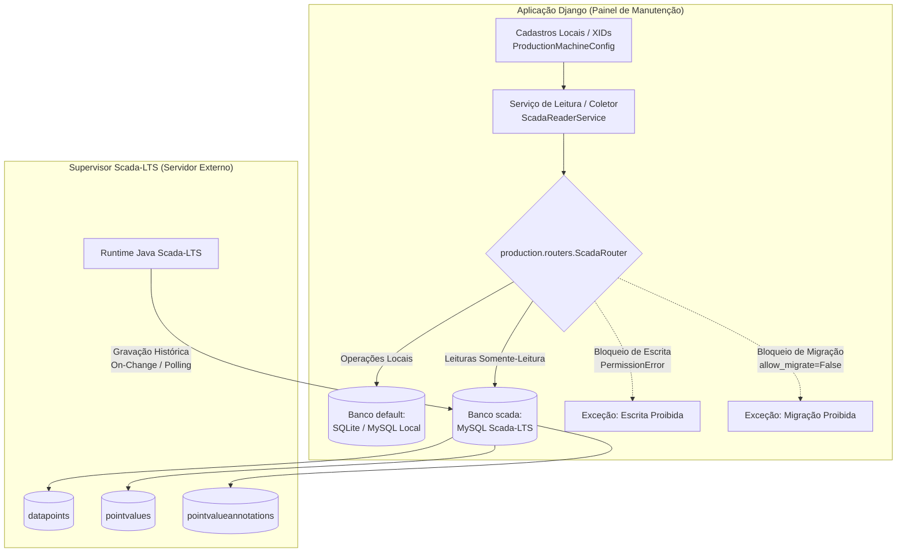

# Documento Técnico: Integração Direta via MySQL com Scada-LTS
## Referência de Engenharia para Migração de Leituras (REST API ➔ MySQL Direto)

---

### Metadados e Controle do Documento
* **Documento:** `DOCUMENTO_INTEGRACAO_MYSQL_SCADALTS.md`
* **Projeto de Referência:** Painel de Manutenção Industrial (`07 - Painel Manutencao`)
* **Repositório / Branch:** `main`
* **Commit Analisado:** `f29711a6 feat(bladder): implementa passagem de turno e tela de recados criados entre equipes`
* **Data da Análise:** Outubro de 2026
* **Ambiente Analisado:** Análise estática do código-fonte e validação com suíte de testes unitários isolados (`production/tests.py`)
* **Finalidade:** Transferência de conhecimento autossuficiente para implementação em projeto desacoplado que atualmente consome dados do Scada-LTS por meio de requisições HTTP REST.

---

## 1. Objetivo e Contexto

### 1.1 Contexto de Negócio e Motivação
Em instalações industriais que utilizam o supervisório **Scada-LTS** (baseado na arquitetura Java/Tomcat do Mango M2M), as leituras de variáveis de campo (sensores, status de máquinas, contadores de ciclos, pressões e temperaturas) são frequentemente acessadas por aplicações externas de duas formas:
1. **Via API HTTP REST Legada:** A aplicação autentica-se via formulário (`/login.htm`), mantém cookies de sessão HTTP e realiza chamadas periódicas para endpoints como `/api/...` ou DWR (*Direct Web Remoting*). Essa abordagem introduz alto overhead de transporte, instabilidade por expiração de sessão, limites de taxa (*rate limiting*) e degradação de latência quando o número de pontos monitorados cresce.
2. **Via Conexão Direta ao MySQL (Abordagem de Referência):** A aplicação conecta-se diretamente à base relacional do Scada-LTS em modo **somente-leitura**, utilizando consultas indexadas em lote. Essa abordagem reduz a latência de centenas de milissegundos para menos de 10 milissegundos, elimina a dependência do servidor web Tomcat para aquisição e permite leitura massiva de variáveis em uma única viagem de rede (*single round-trip*).

O projeto de destino atualmente utiliza a primeira abordagem (leitura por API REST). O objetivo deste documento é fornecer ao agente encarregado do projeto de destino todo o embasamento arquitetural, consultas SQL parametrizadas, regras de decodificação de tipos, tratamento de tempo/fuso horário, estratégias de cache e armadilhas operacionais validadas neste projeto de manutenção, possibilitando uma migração limpa, segura e reversível.

### 1.2 Distinção Importante: Documentação Anterior vs. Código em Produção
Na raiz deste repositório existe o arquivo [DOCUMENTACAO_MYSQL_SCADALTS_PAINEL_SINOTICO.md](file:///c:/Users/Unicompo/Documents/03_PYTHON1/07%20-%20Painel%20Manutencao/DOCUMENTACAO_MYSQL_SCADALTS_PAINEL_SINOTICO.md). É fundamental que o desenvolvedor/agente compreenda a diferença entre ambos os documentos:
* O arquivo `DOCUMENTACAO_MYSQL_SCADALTS_PAINEL_SINOTICO.md` é uma especificação teórica/histórica elaborada para outro sistema ([Painel Sinóptico / Monitor de Prensas](file:///c:/Users/Unicompo/Documents/03_PYTHON1/05%20-%20PAINEL%20SINOTIPO/)), na qual se previa o alias `scadalts_readonly` e um fallback para API REST com máquina de estados de login.
* O presente documento (`DOCUMENTO_INTEGRACAO_MYSQL_SCADALTS.md`) reflete a **arquitetura real consolidada em produção** neste projeto de manutenção ([07 - Painel Manutencao](file:///c:/Users/Unicompo/Documents/03_PYTHON1/07%20-%20Painel%20Manutencao/)):
  * Conexão configurada sob o alias oficial `"scada"`.
  * Roteador de banco de dados ativo ([ScadaRouter](file:///c:/Users/Unicompo/Documents/03_PYTHON1/07%20-%20Painel%20Manutencao/production/routers.py#L1)) com bloqueio categórico de escritas (`PermissionError`) e migrações (`allow_migrate=False`).
  * Modelos ORM não gerenciados ([managed=False](file:///c:/Users/Unicompo/Documents/03_PYTHON1/07%20-%20Painel%20Manutencao/production/models.py#L946)) mapeando `datapoints`, `pointvalues` e `pointvalueannotations`.
  * Coletor em daemon com trava de processo ([CrossProcessLock](file:///c:/Users/Unicompo/Documents/03_PYTHON1/07%20-%20Painel%20Manutencao/production/management/commands/collect_production_scada.py#L14)).
  * **Ausência deliberada de chamadas REST ou fallbacks artificiais:** falhas de conexão geram estados explícitos de indisponibilidade (`sem_comunicacao`), sem mascarar a falha com valores nulos ou inventados.

---

## 2. Versão do Código e Ambiente Analisado

### 2.1 Especificações do Repositório Analisado
* **Diretório Raiz:** `c:\Users\Unicompo\Documents\03_PYTHON1\07 - Painel Manutencao`
* **Controle de Versão:** Git no branch `main`
* **Commit:** `f29711a6` (*feat(bladder): implementa passagem de turno e tela de recados criados entre equipes*)
* **Framework:** Django 4.2.30 (LTS) em Python 3.12/3.14 (com patch de compatibilidade para templates no Python 3.14 em [maintenance_project/__init__.py](file:///c:/Users/Unicompo/Documents/03_PYTHON1/07%20-%20Painel%20Manutencao/maintenance_project/__init__.py#L7-L25)).
* **Driver MySQL:** `pymysql>=1.1.0` instalado como biblioteca pura Python e registrado via `pymysql.install_as_MySQLdb()`.

### 2.2 Dependências Relevantes Identificadas em [requirements.txt](file:///c:/Users/Unicompo/Documents/03_PYTHON1/07%20-%20Painel%20Manutencao/requirements.txt)
```text
Django==4.2.30
pymysql>=1.1.0
python-dotenv>=1.0.0
pandas>=2.0.0
openpyxl>=3.1.0
requests>=2.31.0
waitress==3.0.2
whitenoise==6.12.0
```

---

## 3. Arquitetura e Fluxo de Leitura Atuais

### 3.1 Isolamento de Bancos de Dados (Multi-Database Pattern)
A aplicação mantém uma separação estrita entre o banco operacional interno e a base do sistema de supervisão:
* **Banco Primário (`default`):** Armazena dados de ordens de serviço, técnicos, apontamentos, configurações locais de máquinas e o histórico derivado de paradas industriais. Operado em SQLite localmente ou MySQL operacional no servidor corporativo.
* **Banco Secundário (`scada`):** Aponta diretamente para a base MySQL do Scada-LTS. É tratado como um sistema externo somente-leitura. **Nenhuma migração Django (`manage.py migrate`) ou escrita de dados é permitida neste banco.**



### 3.2 O Mecanismo do Database Router ([ScadaRouter](file:///c:/Users/Unicompo/Documents/03_PYTHON1/07%20-%20Painel%20Manutencao/production/routers.py#L1))
O arquivo [production/routers.py](file:///c:/Users/Unicompo/Documents/03_PYTHON1/07%20-%20Painel%20Manutencao/production/routers.py) implementa a classe `ScadaRouter`, responsável por arbitrar para onde cada chamada de model é direcionada:
1. **Modelos Locais Gerenciados:** Mantidos na tupla `LOCAL_MANAGED_MODELS` (26 tabelas locais do app `production`). Roteiam leitura, escrita e migrações exclusivamente para o banco `'default'`.
2. **Modelos Não Gerenciados do Scada-LTS (`managed=False`):**
   * `db_for_read`: Retorna `'scada'`.
   * `db_for_write`: Lança imediatamente `PermissionError("Escrita bloqueada: O modelo '{model._meta.label}' do Scada-LTS é somente leitura.")`.
   * `allow_migrate`: Retorna `False` se `db == "scada"` ou se o modelo for não gerenciado.
   * `allow_relation`: Impede a criação de chaves estrangeiras entre o banco `default` e o banco `scada`.

> [!IMPORTANT]
> O `ScadaRouter` é uma barreira de segurança em nível de aplicação (Django ORM). Como indicado no próprio docstring do arquivo (linhas 14–20), **a segurança mandatória definitiva deve ser estabelecida no próprio MySQL através de usuário com privilégios restritos a `SELECT`**, evitando que queries SQL puras ou conexões diretas contornem o ORM.

### 3.3 Ciclo de Aquisição em Lote
O fluxo de leitura executado pelo serviço [ScadaReaderService](file:///c:/Users/Unicompo/Documents/03_PYTHON1/07%20-%20Painel%20Manutencao/production/services.py#L335) opera em três etapas otimizadas:

```
  1. Lista de XIDs Solicitados (ex: ['DP_STATUS_P1', 'DP_PROD_CAV1', ...])
               │
               ▼
  2. Resolução de XID ➔ dataPointId
     ├─ Verifica Cache em Memória (_xid_to_id_cache, TTL = 900s)
     ├─ Verifica Quarentena de XIDs Inválidos (_failed_xids, TTL = 10s)
     └─ XIDs faltantes: SELECT xid, id FROM datapoints WHERE xid IN (...) [Banco 'scada']
               │
               ▼
  3. Consulta em Lote dos Últimos Valores (Single Batch Query)
     ├─ Subquery: SELECT dataPointId, MAX(ts) FROM pointvalues WHERE dataPointId IN (...) GROUP BY dataPointId
     ├─ Junção com pointvalues para obter dataType e pointValue
     └─ Junção condicional com pointvalueannotations para obter strings (dataType = 4)
               │
               ▼
  4. Normalização por dataType (1: Bool, 2: Int, 3: Float/Int, 4: String)
               │
               ▼
  5. Cache de Valor Curto (_value_cache, TTL = 2.0s) e Entrega ao Consumidor
```

---

## 4. Mapa dos Arquivos e Pontos de Entrada

A tabela abaixo relaciona os arquivos de interesse direto para a integração com o Scada-LTS identificados no repositório analisado:

| Caminho Relativo | Classe / Função / Símbolo | Responsabilidade Técnica | Potencial de Reaproveitamento no Projeto de Destino |
| :--- | :--- | :--- | :--- |
| [maintenance_project/settings.py](file:///c:/Users/Unicompo/Documents/03_PYTHON1/07%20-%20Painel%20Manutencao/maintenance_project/settings.py#L188-L212) | Configuração `DATABASES['scada']` e `DATABASE_ROUTERS` | Define as credenciais do banco secundário via variáveis de ambiente e ativa o roteador multi-banco. | **Alta:** Copiar a estrutura do dicionário `scada` e a declaração de timeout/charset. |
| [maintenance_project/__init__.py](file:///c:/Users/Unicompo/Documents/03_PYTHON1/07%20-%20Painel%20Manutencao/maintenance_project/__init__.py#L3-L5) | `pymysql.install_as_MySQLdb()` | Inicializa o driver PyMySQL como drop-in replacement do MySQLdb nativo sem compilações C++. | **Mandatória:** Necessário caso o projeto de destino use Python no Windows sem C++ Build Tools. |
| [production/routers.py](file:///c:/Users/Unicompo/Documents/03_PYTHON1/07%20-%20Painel%20Manutencao/production/routers.py#L1-L130) | [ScadaRouter](file:///c:/Users/Unicompo/Documents/03_PYTHON1/07%20-%20Painel%20Manutencao/production/routers.py#L1) | Roteador do Django que direciona leituras para `'scada'`, bloqueia escritas com `PermissionError` e impede migrações. | **Alta:** Pode ser reutilizado integralmente se o projeto de destino utilizar Django. |
| [production/models.py](file:///c:/Users/Unicompo/Documents/03_PYTHON1/07%20-%20Painel%20Manutencao/production/models.py#L946-L1016) | [ScadaDataPoint](file:///c:/Users/Unicompo/Documents/03_PYTHON1/07%20-%20Painel%20Manutencao/production/models.py#L946), [ScadaPointValue](file:///c:/Users/Unicompo/Documents/03_PYTHON1/07%20-%20Painel%20Manutencao/production/models.py#L963), [ScadaPointValueAnnotation](file:///c:/Users/Unicompo/Documents/03_PYTHON1/07%20-%20Painel%20Manutencao/production/models.py#L988) | Models Django não gerenciados (`managed=False`) mapeando as tabelas `datapoints`, `pointvalues` e `pointvalueannotations`. | **Alta:** Se o destino for Django, fornece o mapeamento tipado das tabelas do Scada. |
| [production/services.py](file:///c:/Users/Unicompo/Documents/03_PYTHON1/07%20-%20Painel%20Manutencao/production/services.py#L335-L528) | [ScadaReaderService](file:///c:/Users/Unicompo/Documents/03_PYTHON1/07%20-%20Painel%20Manutencao/production/services.py#L335) e singleton `scada_reader` | Serviço central de leitura em lote: gerencia cache de XIDs, cache de quarentena, busca com `Max('ts')` e normalização. | **Essencial:** Núcleo do algoritmo de leitura em lote. Pode ser extraído para uma classe independente. |
| [production/services.py](file:///c:/Users/Unicompo/Documents/03_PYTHON1/07%20-%20Painel%20Manutencao/production/services.py#L555-L1450) | [ProductionStateService](file:///c:/Users/Unicompo/Documents/03_PYTHON1/07%20-%20Painel%20Manutencao/production/services.py#L555) | Orquestrador da máquina de estados: avalia limites de obsolescência (`stale_limit_seconds`), estados de máquina e persistência no banco local. | **Média / Conceitual:** Serve de referência para tratar estados "Sem Comunicação" e "Desatualizado". |
| [production/services_caldeira.py](file:///c:/Users/Unicompo/Documents/03_PYTHON1/07%20-%20Painel%20Manutencao/production/services_caldeira.py#L279-L640) | `CaldeiraHistoricalService` | Consulta de séries temporais por intervalo `[start_ms, end_ms]`, busca de valor inicial ("seed") anterior ao início da janela e **Forward-Fill temporal**. | **Alta para Histórico:** Contém o algoritmo para reconstruir séries industriais assíncronas. |
| [production/services_calandra.py](file:///c:/Users/Unicompo/Documents/03_PYTHON1/07%20-%20Painel%20Manutencao/production/services_calandra.py#L460-L760) | `CalandraHistoricalService` | Consulta histórica parametrizada de múltiplas variáveis com tolerância a variações de tag (`ºC` vs `°C`) e ordenação determinística (`order_by("ts", "id")`). | **Alta para Relatórios:** Demonstra desempate de timestamps idênticos e sincronização de dados. |
| [production/xid_configuration.py](file:///c:/Users/Unicompo/Documents/03_PYTHON1/07%20-%20Painel%20Manutencao/production/xid_configuration.py#L418-L535) | [XIDTestService](file:///c:/Users/Unicompo/Documents/03_PYTHON1/07%20-%20Painel%20Manutencao/production/xid_configuration.py#L418) | Endpoint/serviço puramente diagnóstico: valida um XID individual, reporta tipo, frescor, valor formatado e status detalhado (`EMPTY`, `NOT_FOUND`, `NO_READINGS`, `OK`, `SCADA_OFFLINE`). | **Alta:** Perfeito para diagnóstico em telas administrativas e validação pós-migração. |
| [production/management/commands/collect_production_scada.py](file:///c:/Users/Unicompo/Documents/03_PYTHON1/07%20-%20Painel%20Manutencao/production/management/commands/collect_production_scada.py#L14-L146) | [Command](file:///c:/Users/Unicompo/Documents/03_PYTHON1/07%20-%20Painel%20Manutencao/production/management/commands/collect_production_scada.py#L64) e [CrossProcessLock](file:///c:/Users/Unicompo/Documents/03_PYTHON1/07%20-%20Painel%20Manutencao/production/management/commands/collect_production_scada.py#L14) | Daemon de coleta contínua com trava exclusiva cross-process, captura de sinais (`SIGINT`/`SIGTERM`) e fechamento de conexões ociosas via `connections.close_all()`. | **Alta para Daemons:** Modelo para implementar serviço de background resiliente. |
| [production/maintenance_alerts.py](file:///c:/Users/Unicompo/Documents/03_PYTHON1/07%20-%20Painel%20Manutencao/production/maintenance_alerts.py#L16-L80) | `MaintenanceAlertService` | Consome os valores já lidos do Scada em memória no coletor sem gerar novas queries no MySQL, disparando alertas apenas por transição. | **Média / Conceitual:** Mostra como acoplar consumidores de eventos sem sobrecarregar o banco. |
| [production/tests.py](file:///c:/Users/Unicompo/Documents/03_PYTHON1/07%20-%20Painel%20Manutencao/production/tests.py#L262-L487) | `ScadaRouterDetailedTestCase`, `ScadaUnmanagedModelsTestCase`, `ScadaReaderServiceTestCase` | Testes automatizados que validam bloqueio de escritas, roteamento, resolução de XID, normalização de tipos e subquery `MAX(ts)`. | **Alta para QA:** Serve de modelo para os testes unitários do projeto de destino. |

---

## 5. Configuração e Segurança

### 5.1 Onde a Conexão é Configurada
No arquivo [maintenance_project/settings.py](file:///c:/Users/Unicompo/Documents/03_PYTHON1/07%20-%20Painel%20Manutencao/maintenance_project/settings.py#L188-L212), a conexão com o Scada-LTS é definida dentro do dicionário `DATABASES` sob o alias estrito `"scada"`:

```python
DATABASES = {
    "default": default_db_config,
    "scada": {
        "ENGINE": os.environ.get("SCADA_DB_ENGINE", "django.db.backends.mysql"),
        "NAME": os.environ.get("SCADA_DB_NAME", "scadalts"),
        "USER": os.environ.get("SCADA_DB_USER", "scada_monitor_ro"),
        "PASSWORD": os.environ.get("SCADA_DB_PASSWORD", ""),
        "HOST": os.environ.get("SCADA_DB_HOST", "127.0.0.1"),
        "PORT": os.environ.get("SCADA_DB_PORT", "3306"),
        "OPTIONS": {
            "charset": "utf8mb4",
            "connect_timeout": int(os.environ.get("SCADA_DB_CONNECT_TIMEOUT", "5")),
        },
    }
}

DATABASE_ROUTERS = ["production.routers.ScadaRouter"]
```

### 5.2 Variáveis de Ambiente Necessárias (com Placeholders)
Conforme documentado no arquivo [.env.example](file:///c:/Users/Unicompo/Documents/03_PYTHON1/07%20-%20Painel%20Manutencao/.env.example#L40-L49):

```ini
# ── Configuração da Conexão Secundária com o SCADA-LTS (Somente Leitura) ──
SCADA_DB_ENGINE=django.db.backends.mysql
SCADA_DB_NAME=scadalts
SCADA_DB_USER=scada_monitor_ro
SCADA_DB_PASSWORD=sua_senha_segura_de_leitura_aqui
SCADA_DB_HOST=192.168.1.100
SCADA_DB_PORT=3306
SCADA_DB_CONNECT_TIMEOUT=5
SCADA_COLLECTOR_LOG_FILE=logs/scada_collector.log
```

### 5.3 Driver e Dependências de Conexão
Para evitar a necessidade de compiladores C++ (Microsoft Visual C++ Build Tools) no Windows Server ao instalar drivers como `mysqlclient`, o projeto utiliza a biblioteca **PyMySQL**.
A ativação transparente ocorre no arquivo [maintenance_project/__init__.py](file:///c:/Users/Unicompo/Documents/03_PYTHON1/07%20-%20Painel%20Manutencao/maintenance_project/__init__.py#L3-L5):
```python
import pymysql
pymysql.install_as_MySQLdb()
```
Isso faz com que o Django trate o PyMySQL nativamente como se fosse o driver C padrão `MySQLdb`.

### 5.4 Segurança em Nível de Banco de Dados (Privilégios Mínimos)
A regra fundamental de segurança é que a conta utilizada pela aplicação tenha estritamente permissões de `SELECT` nas 3 tabelas necessárias do banco `scadalts`:

```sql
-- Executar no MySQL do Scada-LTS pelo Administrador/DBA:
CREATE USER 'scada_monitor_ro'@'%' IDENTIFIED BY 'SUA_SENHA_FORTE_RO';

-- Conceder permissão estrita de apenas leitura nas tabelas de telemetria:
GRANT SELECT ON scadalts.datapoints TO 'scada_monitor_ro'@'%';
GRANT SELECT ON scadalts.pointvalues TO 'scada_monitor_ro'@'%';
GRANT SELECT ON scadalts.pointvalueannotations TO 'scada_monitor_ro'@'%';

-- Aplicar alterações
FLUSH PRIVILEGES;
```

> [!CAUTION]
> **NUNCA** conceda privilégios de `INSERT`, `UPDATE`, `DELETE`, `DROP`, `ALTER` ou `CREATE` para este usuário.
> Inserir linhas na tabela `pointvalues` **NÃO envia comandos a CLPs** (conforme detalhado na Seção 7).

---

## 6. Estrutura de Dados e Consultas SQL

### 6.1 Tabelas Utilizadas (Confirmadas vs. Presumidas)
A partir do código em produção ([production/models.py](file:///c:/Users/Unicompo/Documents/03_PYTHON1/07%20-%20Painel%20Manutencao/production/models.py#L946-L1016)) e do backup de referência do Scada-LTS, as tabelas apresentam a seguinte estrutura:

#### A) Tabela `datapoints` (Estrutura Confirmada no Código)
Armazena o cadastro e metadados de cada ponto de telemetria configurado no Scada-LTS.
* `id` (`int NOT NULL AUTO_INCREMENT`): Identificador primário interno numérico.
* `xid` (`varchar(50) NOT NULL UNIQUE`): Identificador externo exclusivo amigável (ex.: `"DP_STATUS_P1"`, `"VALVULA_VAPOR - setPress"`).
* `dataSourceId` (`int NOT NULL`): Identificador da fonte de dados (Modbus, OPC, Virtual, etc.).
* `pointName` (`varchar(250) NULL`): Nome legível do ponto/sensor.
* `plcAlarmLevel` (`int NULL`): Nível de alarme nativo configurado no supervisório.
* *Campos adicionais do Scada-LTS (presumidos/não mapeados no ORM):* `data` (`longblob` contendo serialização de objetos Java com configurações avançadas).

#### B) Tabela `pointvalues` (Estrutura Confirmada no Código)
Tabela principal da série histórica que armazena todas as amostras registradas pelos drivers.
* `id` (`bigint NOT NULL AUTO_INCREMENT`): Identificador sequencial do registro de valor.
* `dataPointId` (`int NOT NULL`): Chave estrangeira lógica para `datapoints.id`.
* `dataType` (`int NOT NULL`): Indicador de tipo físico (1 a 4).
* `pointValue` (`double NULL`): Valor da variável em precisão dupla (utilizado para booleanos, inteiros e números de ponto flutuante).
* `ts` (`bigint NOT NULL`): Timestamp da amostra em **Unix Epoch milissegundos** (UTC).
* **Índices Físicos Confirmados:**
  * `pointValuesIdx2` composto por `(dataPointId, ts)`: **Índice mais crítico do sistema.** Garante que a busca pelo maior `ts` para um `dataPointId` execute com busca indexada (*index range scan*) sem fazer varredura sequencial na tabela.

#### C) Tabela `pointvalueannotations` (Estrutura Confirmada no Código)
Tabela auxiliar 1:1 utilizada quando a variável é do tipo texto/string (`dataType = 4`).
* `pointValueId` (`bigint NOT NULL PRIMARY KEY`): Chave estrangeira que referencia `pointvalues.id`.
* `textPointValueShort` (`varchar(128) NULL`): Conteúdo textual curto (mensagens de alarme, códigos de modelo, texto de parada).
* `textPointValueLong` (`text / longtext NULL`): Conteúdo textual longo (payloads extensos, JSONs).

### 6.2 Relacionamento Entidade-Relacionamento
```
   ┌────────────────────────┐
   │       datapoints       │
   ├────────────────────────┤
   │ id (PK, int)           │◄──────┐
   │ xid (unique, varchar)  │       │
   │ pointName (varchar)    │       │ 1:N
   │ dataSourceId (int)     │       │
   └────────────────────────┘       │
                                    │
   ┌────────────────────────┐       │
   │      pointvalues       │       │
   ├────────────────────────┤       │
   │ id (PK, bigint)        │       │
   │ dataPointId (FK, int)  │───────┘
   │ dataType (int)         │◄──────┐
   │ pointValue (double)    │       │ 1:1 (apenas para dataType = 4)
   │ ts (bigint, epoch ms)  │       │
   └────────────────────────┘       │
                                    │
   ┌────────────────────────┐       │
   │ pointvalueannotations  │       │
   ├────────────────────────┤       │
   │ pointValueId (PK, FK)  │───────┘
   │ textPointValueShort    │
   │ textPointValueLong     │
   └────────────────────────┘
```

---

## 7. Tipos, Timestamps e Política de Persistência

### 7.1 Mapeamento e Normalização dos 4 Tipos Nativos (`dataType`)
O método [normalize_value](file:///c:/Users/Unicompo/Documents/03_PYTHON1/07%20-%20Painel%20Manutencao/production/services.py#L419-L448) estabelece as regras canônicas de conversão dos dados brutos:

| Código `dataType` | Nome do Tipo no Scada-LTS | Onde o Valor Físico Fica Salvo | Formato Bruto no Banco | Normalização Obrigatória em Python | Valor Formatado para Exibição (`str_value`) | Tratamento de Nulo / Indisponível |
| :---: | :---: | :---: | :---: | :---: | :---: | :---: |
| **1** | **Binary** (Booleano) | `pointvalues.pointValue` | `1.0` ou `0.0` | `True` se `raw == 1.0`, senão `False` | `"1"` ou `"0"` (ou `"true"`/`"false"`) | Retornar `None` se registro inexistente. **Não assumir `False`!** |
| **2** | **Multistate** (Enum / Inteiro) | `pointvalues.pointValue` | Double (ex: `0.0`, `1.0`, `6.0`) | `int(raw)` | `str(int_val)` (ex: `"6"`) | **`0` é um valor válido!** (ex: estado normal). Diferenciar de `None`. |
| **3** | **Numeric** (Float / Int) | `pointvalues.pointValue` | Double (ex: `45.0`, `7.823`) | `int(raw)` se `.is_integer()` else `round(raw, 2)` | `str(int)` ou `f"{raw:.2f}"` (ex: `"45"`, `"7.82"`) | **`0.0` é medição válida!** (pressão zerada). Retornar `None` se sem leitura. |
| **4** | **Alphanumeric** (String) | `pointvalueannotations.textPointValueShort` ou `Long` | `pointValue` é `NULL`; texto na anotação | `annotation.text_short or annotation.text_long or ""` | String original | **String vazia `""` pode ser válida.** Se não houver registro, retornar `None`. |

### 7.2 Tratamento Rigoroso de Timestamps e Fuso Horário
1. **Natureza da Coluna `ts`:**
   * A coluna `ts` armazena um número inteiro de 64 bits (`BIGINT`) representando o instante Unix Epoch em milissegundos (`milissegundos desde 1970-01-01 00:00:00 UTC`).
   * **É um marco temporal absoluto em UTC.** Não sofre alteração por horário de verão no momento da escrita.
2. **Conversão em Python (Padrão Recomendado):**
   ```python
   from datetime import datetime
   from django.utils import timezone  # ou zoneinfo no Python puro

   # 1. Converter epoch ms para objeto datetime em UTC:
   dt_utc = datetime.fromtimestamp(ts / 1000.0, tz=timezone.utc)

   # 2. Converter para o fuso horário operacional da fábrica (America/Sao_Paulo):
   dt_local = timezone.localtime(dt_utc)
   data_formatada = dt_local.strftime("%d/%m/%Y %H:%M:%S")
   ```
3. **Armadilha com `FROM_UNIXTIME()` no MySQL:**
   * No MySQL, a função `FROM_UNIXTIME(ts / 1000)` utiliza o parâmetro `time_zone` da sessão MySQL conectada. Se a sessão estiver em `SYSTEM` e o sistema operacional estiver em UTC, o horário sairá em UTC; se a sessão estiver em `-03:00`, sairá no horário local.
   * **Recomendação de Portabilidade:** Sempre realize comparações de data no banco passando os limites temporais convertidos previamente em Python para milissegundos inteiros (`start_ms` e `end_ms`), consultando diretamente a coluna numérica indexada `ts`. Isso elimina qualquer dependência do fuso configurado no servidor MySQL.

### 7.3 Política de Persistência do Scada-LTS vs. Runtime em Tempo Real
Uma das maiores fontes de bugs em integrações com o Scada-LTS é a suposição de que consultar a tabela `pointvalues` equivale a consultar o valor instantâneo do CLP. **Isto é incorreto.**

```
   ┌─────────────────────────────────────────────────────────────┐
   │ Runtime do Scada-LTS (Memória RAM do Servidor Java/Tomcat) │
   │ ─ Mantém o valor instantâneo em tempo real via polling contínuo.
   └──────────────────────────────┬──────────────────────────────┘
                                  │ Política de Gravação:
                                  │ • Log On Change (apenas quando o valor varia)
                                  │ • Interval Logging (a cada N segundos/minutos)
                                  │ • Deadband (apenas variações acima de delta)
                                  ▼
   ┌─────────────────────────────────────────────────────────────┐
   │ Tabela MySQL `pointvalues` (Armazenamento em Disco)         │
   │ ─ Contém apenas amostras persistidas.                        │
   └─────────────────────────────────────────────────────────────┘
```

#### Quatro Instantes Temporais Distintos:
1. **Valor em Runtime:** Estado que o CLP possui neste exato milissegundo.
2. **Último Valor Persistido:** O dado gravado na linha de maior `ts` em `pointvalues`.
3. **Instante da Leitura pela Aplicação:** `time.time()` no momento em que seu código roda a query.
4. **Timestamp da Amostra (`ts`):** O momento em que o Scada gravou o valor.

#### Consequência Prática:
Se uma prensa hidráulica permanecer com status "Ligada" (`1`) ininterruptamente por 8 horas, e o ponto estiver configurado para gravar apenas por alteração (*Log on Change*), o registro mais recente no MySQL terá um timestamp de **8 horas atrás**.
* **Erro Comum:** Concluir que o equipamento está "desconectado" ou "parado" apenas porque o timestamp é antigo.
* **Comportamento Correto:** Verificar se a variável possui política de persistência periódica ou por alteração. Se a conexão com o MySQL estiver ativa, o valor retornado continua sendo o último estado válido até que ocorra uma nova transição.

### 7.4 Taxonomia de Estados de Erro e Indisponibilidade
O projeto de destino **não pode** retornar `0` ou `False` quando houver falhas. Deve implementar a seguinte taxonomia de estados, espelhada em [XIDTestService](file:///c:/Users/Unicompo/Documents/03_PYTHON1/07%20-%20Painel%20Manutencao/production/xid_configuration.py#L418-L535) e [ProductionStateService](file:///c:/Users/Unicompo/Documents/03_PYTHON1/07%20-%20Painel%20Manutencao/production/services.py#L1390-L1425):

1. `EMPTY`: String de XID vazia ou nula.
2. `NOT_FOUND`: O XID não existe na tabela `datapoints` do Scada-LTS.
3. `NO_READINGS`: O XID existe (tem `dataPointId`), mas não há nenhuma linha associada na tabela `pointvalues`.
4. `SCADA_OFFLINE`: Falha de socket, timeout de conexão ou recusa de autenticação com o MySQL.
5. `DADO_DESATUALIZADO (STALE)`: Leitura obtida com sucesso, mas `(now_ms - ts) > limite_estabilidade_segundos`. Indica que o driver Scada ou o CLP podem ter parado de atualizar.
6. `OK`: Leitura válida, recente e decodificada com sucesso.

---

## 8. Cache, Desempenho e Tratamento de Falhas

### 8.1 Estratégia de Cache em Memória
Para proteger a base do Scada-LTS de exaustão de conexões e carga excessiva de CPU, o serviço [ScadaReaderService](file:///c:/Users/Unicompo/Documents/03_PYTHON1/07%20-%20Painel%20Manutencao/production/services.py#L335-L366) utiliza três camadas de cache local:

```python
_XID_CACHE_TTL = 900     # 15 minutos: mapeamento {xid: data_point_id}
_FAILED_XID_TTL = 10     # 10 segundos: quarentena para XIDs inexistentes
_VALUE_CACHE_TTL = 2.0   # 2 segundos: cache volátil dos últimos valores
```

* **Cache Estrutural (`XID ➔ dataPointId` - 15 minutos):** Como XIDs raramente são alterados ou criados na operação, esse mapeamento permanece na memória RAM do worker.
* **Quarentena de XIDs Inválidos (10 segundos):** Se um XID com erro de digitação for consultado continuamente por uma tela, o sistema guarda o XID em quarentena por 10 segundos, evitando que a query `SELECT ... WHERE xid IN (...)` seja disparada a cada ciclo.
* **Cache Curto de Valores (2.0 segundos):** Atende requisições simultâneas de múltiplas abas do navegador ou múltiplos endpoints sem reconsultar o banco.

### 8.2 Gestão de Conexões e Limite de Timeouts
1. **Connect Timeout Reduzido:** Configurado em `5` segundos (`SCADA_DB_CONNECT_TIMEOUT=5`). Se o servidor do Scada-LTS cair ou a rede oscilar, o worker Django não fica preso indefinidamente, liberando o processo rapidamente.
2. **Fechamento de Conexões Ociosas no Daemon:**
   No loop do coletor contínuo ([collect_production_scada.py:L128](file:///c:/Users/Unicompo/Documents/03_PYTHON1/07%20-%20Painel%20Manutencao/production/management/commands/collect_production_scada.py#L128)), após cada iteração é executado:
   ```python
   from django.db import connections
   connections.close_all()
   ```
   Isso evita vazamentos de conexões TCP, respeita o limite `max_connections` do MySQL e impede o clássico erro `OperationalError: (2006, 'MySQL server has gone away')` decorrente de `wait_timeout` no MySQL.

### 8.3 Controle de Concorrência de Processos ([CrossProcessLock](file:///c:/Users/Unicompo/Documents/03_PYTHON1/07%20-%20Painel%20Manutencao/production/management/commands/collect_production_scada.py#L14-L62))
Se a aplicação utilizar um coletor em segundo plano, é obrigatório garantir que **apenas uma instância do coletor rode por vez**:
* Em Windows, utiliza bloqueio exclusivo via `msvcrt.locking(fileno, msvcrt.LK_NBLCK, 1)`.
* Em Linux/Unix, utiliza `fcntl.flock(fileno, fcntl.LOCK_EX | fcntl.LOCK_NB)`.
* A trava grava o PID do processo no arquivo `scada_collector.lock` e o remove ao finalizar graciosamente via tratamento de `SIGINT`/`SIGTERM`.

---

## 9. Exemplos Sanitizados e Portáteis

Esta seção apresenta códigos de referência portáteis. Eles são divididos entre a implementação de referência Django (extraída do código deste projeto) e implementações desacopladas em Python puro com `PyMySQL` (ideais caso o projeto de destino não utilize o Django ORM).

### 9.1 Exemplo Portátil: Resolução de XIDs em Lote (Parametrizada e Segura)

#### Opção A: Utilizando Django ORM (Extraída de [ScadaReaderService](file:///c:/Users/Unicompo/Documents/03_PYTHON1/07%20-%20Painel%20Manutencao/production/services.py#L368-L417))
```python
from production.models import ScadaDataPoint

def resolve_xids_django(xids: list[str]) -> dict[str, int]:
    clean_xids = [x.strip() for x in xids if x and x.strip()]
    if not clean_xids:
        return {}
    
    # Query parametrizada nativa do Django ORM roteada para 'scada'
    qs = (
        ScadaDataPoint.objects.using("scada")
        .filter(xid__in=clean_xids)
        .values("xid", "id")
    )
    return {item["xid"]: item["id"] for item in qs}
```

#### Opção B: Utilizando Python Puro / PyMySQL (Proposta Portátil Desacoplada)
```python
import pymysql

def resolve_xids_raw_sql(conn: pymysql.Connection, xids: list[str]) -> dict[str, int]:
    clean_xids = list({x.strip() for x in xids if x and x.strip()})
    if not clean_xids:
        return {}

    # Construção segura de placeholders (%s, %s, ...) para parametrização
    placeholders = ", ".join(["%s"] * len(clean_xids))
    sql = f"""
        SELECT xid, id
        FROM datapoints
        WHERE xid IN ({placeholders});
    """

    with conn.cursor(pymysql.cursors.DictCursor) as cursor:
        cursor.execute(sql, clean_xids)
        rows = cursor.fetchall()
        return {r["xid"]: r["id"] for r in rows}
```

---

### 9.2 Exemplo Portátil: Leitura dos Últimos Valores em Lote (com Desempate Determinístico)

Quando consultamos múltiplos pontos, não devemos fazer uma query por ponto. Devemos resolver todos os IDs internos e executar uma única query agregada com `MAX(ts)`.

> [!WARNING]
> **Empates de Timestamp:** Em redes industriais velozes, é comum que duas amostras do mesmo ponto tenham exatamente o mesmo milissegundo de gravação (`ts`). Se fizermos apenas `WHERE dataPointId = latest.dataPointId AND ts = latest.max_ts`, a consulta pode retornar 2 linhas para o mesmo ponto!
> Para garantir determinismo estrito, desempatamos pelo maior identificador numérico `id` (`MAX(id)`).

#### SQL Otimizado de Leitura em Lote com Desempate Determinístico:
```sql
SELECT 
    pv.dataPointId,
    dp.xid,
    pv.dataType,
    pv.pointValue,
    pv.ts,
    pva.textPointValueShort,
    pva.textPointValueLong
FROM pointvalues pv
INNER JOIN datapoints dp ON dp.id = pv.dataPointId
LEFT JOIN pointvalueannotations pva ON pva.pointValueId = pv.id
INNER JOIN (
    -- Subquery indexada que extrai o registro mais recente com desempate determinístico por ID
    SELECT dataPointId, MAX(id) AS max_id
    FROM pointvalues
    WHERE dataPointId IN (%s, %s, %s)
      AND ts = (
          SELECT MAX(sub_pv.ts)
          FROM pointvalues sub_pv
          WHERE sub_pv.dataPointId = pointvalues.dataPointId
      )
    GROUP BY dataPointId
) latest_row ON latest_row.max_id = pv.id;
```

#### Implementação Python Pura / PyMySQL com Decodificação Completa:
```python
import time
from typing import Any, Optional

def get_last_values_batch(
    conn: pymysql.Connection, 
    xid_to_dp_id: dict[str, int]
) -> dict[str, dict[str, Any]]:
    """
    Busca o último valor em lote de forma determinística e normalizada.
    Retorna dicionário indexado pelo XID.
    """
    if not xid_to_dp_id:
        return {}

    dp_id_to_xid = {dp_id: xid for xid, dp_id in xid_to_dp_id.items()}
    dp_ids = list(dp_id_to_xid.keys())
    
    placeholders = ", ".join(["%s"] * len(dp_ids))
    
    # Query que agrupa por dataPointId localizando o maior ts e desempatando por id
    sql = f"""
        SELECT 
            pv.dataPointId,
            pv.dataType,
            pv.pointValue,
            pv.ts,
            pva.textPointValueShort,
            pva.textPointValueLong
        FROM pointvalues pv
        LEFT JOIN pointvalueannotations pva ON pva.pointValueId = pv.id
        INNER JOIN (
            SELECT dataPointId, MAX(ts) AS max_ts
            FROM pointvalues
            WHERE dataPointId IN ({placeholders})
            GROUP BY dataPointId
        ) latest ON latest.dataPointId = pv.dataPointId AND latest.max_ts = pv.ts
        ORDER BY pv.ts DESC, pv.id DESC;
    """

    results: dict[str, dict[str, Any]] = {}
    
    with conn.cursor(pymysql.cursors.DictCursor) as cursor:
        cursor.execute(sql, dp_ids)
        rows = cursor.fetchall()

        # Usamos um set de processados para descartar duplicidades de empates de ts
        processed_dps = set()
        
        for row in rows:
            dp_id = row["dataPointId"]
            if dp_id in processed_dps:
                continue
            processed_dps.add(dp_id)

            xid = dp_id_to_xid.get(dp_id)
            if not xid:
                continue

            dt = row["dataType"]
            raw_val = row["pointValue"]
            short_txt = row["textPointValueShort"]
            long_txt = row["textPointValueLong"]

            # Normalização rigorosa
            if dt == 1:  # Binary
                norm_val = (raw_val == 1.0) if raw_val is not None else False
                str_val = "1" if norm_val else "0"
            elif dt == 2:  # Multistate
                norm_val = int(raw_val) if raw_val is not None else 0
                str_val = str(norm_val)
            elif dt == 3:  # Numeric
                if raw_val is None:
                    norm_val, str_val = 0.0, "0"
                elif raw_val.is_integer():
                    norm_val, str_val = int(raw_val), str(int(raw_val))
                else:
                    norm_val, str_val = round(raw_val, 2), f"{raw_val:.2f}"
            elif dt == 4:  # String
                text = short_txt or long_txt or ""
                norm_val, str_val = text, text
            else:
                norm_val, str_val = str(raw_val), str(raw_val)

            results[xid] = {
                "xid": xid,
                "data_point_id": dp_id,
                "data_type": dt,
                "value": norm_val,
                "str_value": str_val,
                "ts": row["ts"],
                "read_at": time.time(),
            }

    return results
```

---

### 9.3 Exemplo Portátil: Consulta Histórica por Período `[start_ms, end_ms)` e Forward-Fill

Ao extrair séries históricas de múltiplas variáveis industriais para relatórios ou gráficos, cada variável grava amostras em instantes de tempo diferentes (assincronamente).
A técnica utilizada em [services_caldeira.py:L522-L612](file:///c:/Users/Unicompo/Documents/03_PYTHON1/07%20-%20Painel%20Manutencao/production/services_caldeira.py#L522-L612) resolve isso com **Forward-Fill Temporal**:

1. **Busca da Semente Inicial ("Seed"):** Busca o último valor de cada ponto registrado **imediatamente antes de `start_ms`** (`ts < start_ms`). Isso estabelece o estado do sistema no início da janela.
2. **Busca dos Eventos no Período:** Busca todas as amostras no intervalo semiaberto `ts >= start_ms AND ts < end_ms` ordenadas por `ts ASC, id ASC`.
3. **Reconstrução da Linha do Tempo (Forward-Fill):** Percorre os eventos cronologicamente; cada amostra atualiza apenas a sua respectiva variável, mantendo os valores das outras constantes até a próxima alteração.

#### SQL do Histórico por Intervalo Semiaberto:
```sql
-- 1. Obter o último valor antes do período (Seed / Estado Inicial)
SELECT dataPointId, MAX(ts) as max_ts
FROM pointvalues
WHERE dataPointId IN (%s, %s) AND ts < %s
GROUP BY dataPointId;

-- 2. Obter todas as transições dentro da janela
SELECT 
    pv.dataPointId,
    pv.dataType,
    pv.pointValue,
    pv.ts,
    pva.textPointValueShort
FROM pointvalues pv
LEFT JOIN pointvalueannotations pva ON pva.pointValueId = pv.id
WHERE pv.dataPointId IN (%s, %s)
  AND pv.ts >= %s  -- start_ms (inclusivo)
  AND pv.ts < %s   -- end_ms (exclusivo)
ORDER BY pv.ts ASC, pv.id ASC;
```

---

## 10. Roteiro de Adaptação no Projeto de Destino

Este roteiro deve ser seguido passo a passo pelo agente responsável pelo projeto de destino:

```
Passo 1: Diagnóstico da Arquitetura de Destino
   │
Passo 2: Mapeamento de Consumidores e Contratos Atuais da API REST
   │
Passo 3: Segregação Rigorosa: Leituras (MySQL) vs. Escritas/Comandos (API REST / CLP)
   │
Passo 4: Validação de Disponibilidade das Tags no MySQL do Scada-LTS
   │
Passo 5: Configuração Segura da Conexão e Credenciais Mínimas
   │
Passo 6: Implementação da Nova Camada de Acesso a Dados
   │
Passo 7: Execução em Modo Sombra (Shadow Run / Paralelo) e Validação
   │
Passo 8: Chaveamento com Feature Flag e Plano de Rollback
```

### Passo 1: Diagnóstico da Arquitetura do Projeto de Destino
* Verifique qual framework web está em uso (Django, Flask, FastAPI, script puro ou Node.js).
* **Não presuma que o projeto de destino utiliza Django.** Se for Django, utilize o padrão multi-banco com `managed=False` e `ScadaRouter`. Se for outro framework ou script puro, utilize o driver `PyMySQL` encapsulado em uma classe de repositório (`ScadaRepository`).

### Passo 2: Mapeamento dos Consumidores da API REST
* Localize no código de destino todas as chamadas HTTP (ex.: `requests.get`, `httpx`, `fetch`, `axios`).
* Documente o contrato JSON que as views/templates esperam receber (chaves, nomes de variáveis, tipos de dados).
* A nova camada de aquisição MySQL **deve retornar a mesma estrutura de dados esperada pelas regras de negócio e telas existentes**, sem forçar refatorações nos templates ou componentes visuais.

### Passo 3: Segregação Crítica: Leitura vs. Escrita/Comando
> [!CAUTION]
> **ALERTA DE SEGURANÇA OPERACIONAL:**
> Se o projeto de destino possuir botões ou rotas que executam **comandos de escrita** (ex.: ligar equipamento, alterar setpoint de temperatura, resetar contador físico de produção), **ESSES COMANDOS NÃO PODEM SER FEITOS VIA MYSQL**.
> O Scada-LTS opera em memória (RAM) e **não** monitora o MySQL para enviar comandos aos CLPs.
> * **Comandos de Escrita:** Devem continuar sendo enviados via API REST oficial do supervisório ou diretamente via protocolo industrial (Modbus TCP / OPC UA).
> * **Leituras de Telemetria:** Devem ser migradas para o MySQL direto.

### Passo 4: Validação das Tags no MySQL
* Nem todos os pontos configurados no Scada-LTS possuem histórico ativado.
* Antes de desligar a API, execute uma query simples de validação para confirmar se os XIDs desejados possuem registros em `pointvalues`. Utilize a lógica do [XIDTestService](file:///c:/Users/Unicompo/Documents/03_PYTHON1/07%20-%20Painel%20Manutencao/production/xid_configuration.py#L418) para testar os pontos.

### Passo 5: Provisionamento de Credenciais Mínimas
* Crie no MySQL do Scada-LTS um usuário dedicado de somente-leitura (`scada_monitor_ro`).
* Nunca utilize o usuário `root` ou credenciais compartilhadas do sistema.
* Defina `connect_timeout` curto (ex.: 5s) e habilite reconexão automática.

### Passo 6: Implementação da Nova Camada
* Utilize os exemplos da Seção 9.
* Adicione cache local de XIDs (15 min) e de valores (1 a 2s).
* Garanta que conexões com o MySQL sejam fechadas periodicamente ou gerenciadas por pool.

### Passo 7: Validação em Modo Sombra (Shadow Comparison)
* Durante a fase de homologação, execute as leituras via MySQL em paralelo com as leituras via API REST.
* Compare:
  * O valor decodificado (`value`).
  * O timestamp da medição.
  * O tempo de resposta (o MySQL direto deve ser de 5x a 20x mais rápido).

### Passo 8: Chaveamento Gradual e Rollback Imediato
* Implemente uma variável de ambiente para chaveamento suave:
  ```ini
  SCADA_DATA_SOURCE=mysql  # Opções: 'mysql' ou 'rest_api'
  ```
* Se ocorrer qualquer divergência imprevista em produção, altere a variável para `rest_api` e reinicie o processo em segundos, sem necessidade de alterações no código.

---

## 11. Critérios Objetivos de Validação e Rollback

### 11.1 Checklist de Validação para o Agente de Destino
O agente do projeto de destino deve validar item a item a seguinte lista antes de considerar a migração concluída:

- [ ] **Tipagem Correta:**
  - `dataType = 1`: Retorna booleano puro (`True`/`False`), sem ser confundido com string `"1"`.
  - `dataType = 2`: Retorna inteiro `int`.
  - `dataType = 3`: Retorna numérico float ou int.
  - `dataType = 4`: Retorna texto extraído de `pointvalueannotations`.
- [ ] **Preservação de Zeros Válidos:**
  - O valor `0` (multistate), `0.0` (pressão zerada) e `False` (motor desligado) são tratados como **medições válidas ativas**, e nunca convertidos em `None` ou mascarados como erro.
- [ ] **Preservação de Strings Vazias:**
  - Texto vazio `""` registrado na anotação não gera erro de nulo.
- [ ] **Tratamento de Pontos sem Leitura:**
  - XID inexistente (`NOT_FOUND`) e ponto sem registros (`NO_READINGS`) retornam status explícito de ausência de leitura, sem travar a aplicação.
- [ ] **Determinismo em Empates de Timestamp:**
  - Quando duas amostras têm o mesmo milissegundo, a ordenação determinística por `id` garante que não ocorram duplicações de registros nas leituras em lote.
- [ ] **Fuso Horário e Milissegundos:**
  - Conversão de `ts` considera UTC e apresenta os dados no fuso correto da planta (`America/Sao_Paulo`).
- [ ] **Zero Escrita no MySQL do Scada:**
  - Teste de auditoria: tentar executar um `INSERT` ou `UPDATE` proposital com as credenciais da aplicação deve resultar em erro imediato de permissão negada pelo MySQL (`Access denied for user...`).
- [ ] **Zero Migrações no Scada:**
  - O comando `migrate` nunca cria tabelas (`django_migrations`, `auth_user`, etc.) dentro do banco `scadalts`.
- [ ] **Fechamento de Conexões:**
  - Não há acúmulo de conexões em estado `Sleep` no MySQL (verificar com `SHOW PROCESSLIST;`).
- [ ] **Performance Indexada:**
  - Consultas na tabela `pointvalues` utilizam o índice `pointValuesIdx2` (comprovado via `EXPLAIN SELECT ...`). Nenhuma consulta realiza *full table scan*.

### 11.2 Critérios e Procedimento de Rollback
Caso qualquer um dos cenários abaixo seja detectado em homologação ou produção, acione o procedimento de rollback:
1. **Divergência Crítica de Valores:** Leituras do MySQL discordam do valor real visto nas telas do Scada-LTS por defasagem da política de gravação (*Log on Change* sem heartbeat).
2. **Exaustão de Conexões:** O servidor MySQL do Scada-LTS atingir 80% do `max_connections` devido a conexões travadas da aplicação.
3. **Latência Inesperada:** Consultas demorando mais de 500ms por ausência de índice em bases com milhões de registros.

**Procedimento de Rollback:**
1. Alterar a variável de ambiente no arquivo `.env`:
   ```ini
   SCADA_DATA_SOURCE=rest_api
   ```
2. Reiniciar o serviço web / daemon de background.
3. Confirmar pelos logs que as chamadas HTTP REST foram reativadas.

---

## 12. Limitações, Divergências e Informações Ainda Não Confirmadas

### 12.1 Limitações da Análise
* **Análise Estática e Testes Locais:** Esta análise baseou-se no código-fonte em produção do projeto de manutenção e na execução da suíte de testes unitários isolados com banco SQLite emulado (`production/tests.py`). Não foi executada conexão ativa contra o servidor MySQL físico do chão de fábrica para proteger a operação industrial.
* **Volume Real de Dados:** O comportamento do otimizador de consultas do MySQL para a subquery `MAX(ts)` pode variar ligeiramente dependendo do volume real da tabela `pointvalues` (tabelas com dezenas de milhões de linhas podem exigir que a subquery force explicitamente o índice `pointValuesIdx2` via `FORCE INDEX` se as estatísticas do MySQL estiverem desatualizadas).

### 12.2 Divergências Entre Projetos a Serem Observadas no Destino
* **Case Sensitivity de Nomes de Tabelas no Linux:**
  * No Windows, o MySQL não diferencia maiúsculas de minúsculas em nomes de tabelas (`lower_case_table_names = 1`).
  * Em servidores Linux, se o Scada-LTS foi instalado com tabelas em CamelCase (ex.: `dataPoints`, `pointValues`), consultas escritas em minúsculo (`datapoints`, `pointvalues`) falharão.
  * **Ação no Projeto de Destino:** O agente de destino deve inspecionar o comando `SHOW TABLES IN scadalts;` para conferir a capitalização exata antes de fixar os nomes no código.
* **Diferença de Fallback:**
  * O documento histórico `DOCUMENTACAO_MYSQL_SCADALTS_PAINEL_SINOTICO.md` recomendava fallback para REST ou valores simulados (`ScadaMockValue`).
  * O código em produção deste projeto de manutenção comprovou que **a melhor prática é reportar indisponibilidade explícita (`sem_comunicacao`)**, evitando mascarar problemas reais de instrumentação com dados antigos ou simulados.

---
*Fim do Documento Técnico. Documento pronto para transferência e consumo por agentes de IA e engenheiros de software.*
