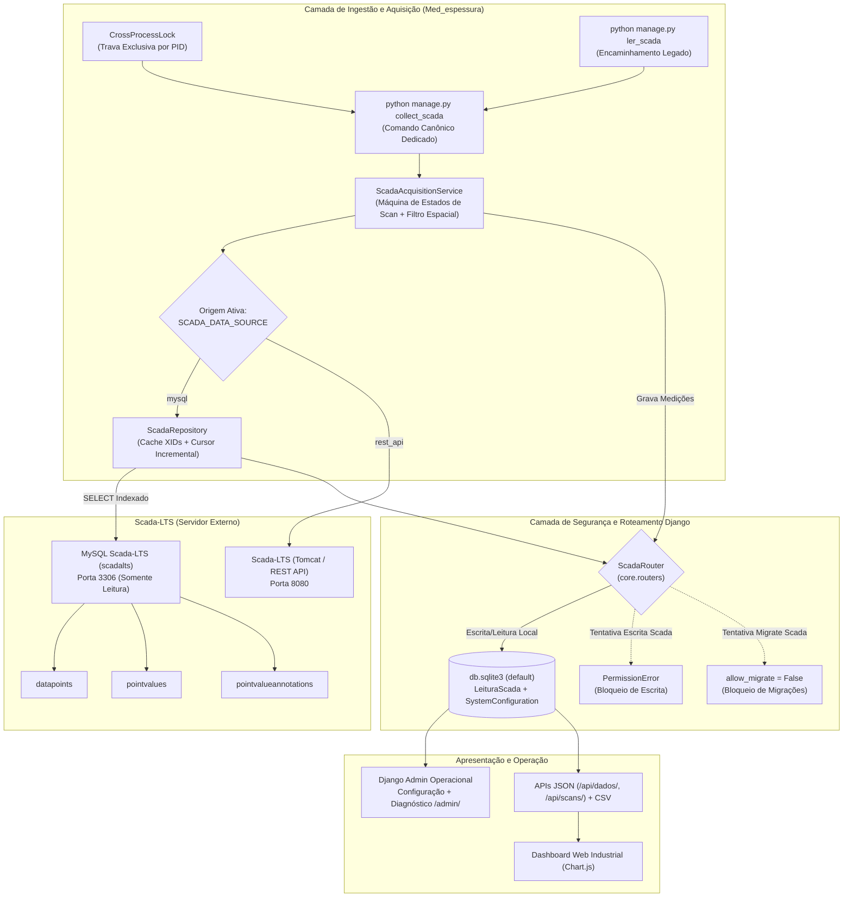

# Relatório Técnico de Implementação
## Migração Arquitetural MySQL Scada-LTS e Área Operacional Django Admin
### Projeto: Medidor de Espessura Industrial (`Med_espessura`)

> **Data de Implementação:** Outubro de 2026  
> **Status:** Concluído, testado (29 testes automatizados) e validado em ambiente local com compatibilidade reversível.  
> **Framework:** Django 6.1.1 | **Python:** 3.14.6 | **Driver:** PyMySQL 1.2.3  

---

## 1. Resumo Executivo

Este documento detalha a implementação da primeira grande evolução arquitetural do projeto **Medidor de Espessura**, cumprindo integralmente os dois objetivos estratégicos estabelecidos:

1. **Camada de Integração Direta via MySQL com Scada-LTS (Somente-Leitura):** Implementação de arquitetura multi-database (`default` + `scada`), com Database Router estrito (`ScadaRouter`) que impede qualquer escrita ou migração no banco externo, repositório de alta performance (`ScadaRepository`) com desempate determinístico de timestamps e consumo incremental de medições via cursor `(ts, id)` para `DP_747174` (evitando perda de pontos entre ciclos de polling).
2. **Transformação Operacional do Django Admin:** Criação de modelo de parametrização centralizado (`SystemConfiguration` em padrão Singleton), administração e auditoria segura de medições (`LeituraScada`), registro somente-leitura dos modelos do Scada (`ScadaDataPoint`, `ScadaPointValue`) e ferramenta de diagnóstico de tags industriais integrada em `/admin/scada-diagnostico/`.
3. **Eliminação de Duplicidade de Coletores:** Criação do comando canônico `python manage.py collect_scada` com trava exclusiva de processo único (*Cross-process Lock* via PID) e compatibilidade com o comando legado `ler_scada`.
4. **Mecanismo de Feature Flag e Rollback Suave:** Alternância em tempo de execução entre `mysql` e `rest_api` via variável de ambiente `SCADA_DATA_SOURCE` e pelo Django Admin, mantendo a camada REST ativa como plano de rollback imediato sem necessidade de alteração de código.

---

## 2. Comparativo de Arquitetura: Anterior vs. Nova

### 2.1 Arquitetura Anterior (REST Legada)
* Coleta via polling HTTP contra o Tomcat do Scada-LTS (`/api/point_value/getValue/...`).
* Duas implementações divergentes coexistindo no código (`core/scada_worker.py` disparado via `apps.py` com credenciais `'teste1'` e loop de 50ms vs. `core/management/commands/ler_scada.py` com credenciais `'teste'` e loop de 200ms).
* Risco de concorrência com escrita duplicada no banco SQLite.
* Parâmetros do processo (espessuras nominais, tolerâncias, intervalos e XIDs) hardcoded no código Python.
* Django Admin completamente vazio (sem models registrados).
* Sem cobertura de testes automatizados.

### 2.2 Arquitetura Nova (Canônica, Multi-DB e Configurável)



---

## 3. Arquivos Criados e Alterados

| Arquivo | Ação | Descrição Técnica |
| :--- | :---: | :--- |
| `setup/settings.py` | Alterado | Adicionado suporte a `python-dotenv`, multi-db (`scada`), `DATABASE_ROUTERS`, fuso `America/Sao_Paulo` e settings de Scada. |
| `setup/__init__.py` | Alterado | Registro de driver `pymysql.install_as_MySQLdb()`. |
| `.env.example` | Criado | Modelo documentado de variáveis de ambiente sem expor senhas. |
| `.env` | Criado | Configuração local segura de desenvolvimento. |
| `requirements.txt` | Alterado | Adicionadas dependências `pymysql>=1.1.0` e `python-dotenv>=1.0.0`. |
| `core/routers.py` | Criado | `ScadaRouter` com bloqueio estrito de escritas (`PermissionError`) e migrações no banco `scada`. |
| `core/models_scada.py` | Criado | Mapeamento não-gerenciado (`managed=False`) de `ScadaDataPoint`, `ScadaPointValue` e `ScadaPointValueAnnotation`. |
| `core/models.py` | Alterado | Adicionado modelo `SystemConfiguration` (padrão Singleton com validações); mantido `LeituraScada` intacto. |
| `core/migrations/0003_...` | Criado | Migration aditiva para `SystemConfiguration` (tabelas do Scada declaradas com `managed=False`). |
| `core/scada_repository.py` | Criado | Camada de repositório indexada, cache TTL, decodificação de tipos 1..4, desempate de timestamps e cursor incremental. |
| `core/scada_service.py` | Criado | Motor de aquisição canônico (`ScadaAcquisitionService`) e trava exclusiva `CrossProcessLock`. |
| `core/management/commands/collect_scada.py` | Criado | Comando canônico de linha de comando para coleta contínua ou teste único (`--once`). |
| `core/management/commands/ler_scada.py` | Alterado | Encaminhamento transparente para `collect_scada` para preservar retrocompatibilidade. |
| `core/apps.py` | Alterado | Desabilitado disparo automático não gerenciado de thread em `ready()`, condicionado a `SCADA_AUTO_WORKER`. |
| `core/scada_worker.py` | Alterado | Adaptado para delegar a `ScadaAcquisitionService` e respeitar `CrossProcessLock`. |
| `core/admin.py` | Alterado | Registrados `LeituraScadaAdmin` (readonly), `SystemConfigurationAdmin` (singleton com fieldsets) e ferramenta `/admin/scada-diagnostico/`. |
| `core/templates/admin/core/scada_diagnostico.html` | Criado | Interface visual para teste em tempo real de XIDs sem escrita. |
| `core/templates/admin/core/scada_offline.html` | Criado | Tela amigável de contingência caso o MySQL remoto esteja inacessível. |
| `core/profile_logic.py` | Alterado | Defaults de borda, centro e tolerância conectados à `SystemConfiguration`. |
| `core/views.py` | Alterado | Injeção da configuração no contexto do template do dashboard. |
| `core/templates/core/dashboard.html` | Alterado | Inputs iniciais pré-carregados com as configurações do Admin. |
| `core/tests.py` | Alterado | Suíte com 29 testes cobrindo router, repositório, máquina de scan, filtro espacial, profile logic, APIs e admin. |
| `Instrucoes_execucao.txt` | Alterado | Documentação atualizada dos novos comandos e rotas administrativas. |

---

## 4. Configuração Segura do MySQL no Scada-LTS

### 4.1 Criação de Usuário Dedicado Somente-Leitura (Executar no MySQL do Scada)
Para respeitar o princípio do menor privilégio (*Principle of Least Privilege*), o usuário utilizado pela aplicação deve possuir estritamente privilégios de `SELECT` nas 3 tabelas necessárias do banco `scadalts`:

```sql
-- Executar como Administrador / DBA no MySQL do Scada-LTS:
CREATE USER 'scada_monitor_ro'@'%' IDENTIFIED BY 'SENHA_FORTE_AQUI';

GRANT SELECT ON scadalts.datapoints TO 'scada_monitor_ro'@'%';
GRANT SELECT ON scadalts.pointvalues TO 'scada_monitor_ro'@'%';
GRANT SELECT ON scadalts.pointvalueannotations TO 'scada_monitor_ro'@'%';

FLUSH PRIVILEGES;
```

> [!CAUTION]
> **NUNCA** conceda permissões de `INSERT`, `UPDATE`, `DELETE`, `DROP`, `ALTER` ou `CREATE`. O Scada-LTS opera em memória (RAM) e gravar no MySQL **não** envia comandos a CLPs.

### 4.2 Variáveis de Ambiente (`.env`)
No servidor da aplicação `Med_espessura`, configure o arquivo `.env`:

```ini
# Seleção da Origem: 'mysql' ou 'rest_api'
SCADA_DATA_SOURCE=mysql

# Conexão MySQL Scada-LTS (Somente Leitura)
SCADA_DB_ENGINE=django.db.backends.mysql
SCADA_DB_NAME=scadalts
SCADA_DB_USER=scada_monitor_ro
SCADA_DB_PASSWORD=SENHA_FORTE_AQUI
SCADA_DB_HOST=192.168.0.202
SCADA_DB_PORT=3306
SCADA_DB_CONNECT_TIMEOUT=5

# Conexão REST (Fallback)
SCADA_REST_BASE_URL=http://192.168.0.202:8080/Scada-LTS
SCADA_REST_USERNAME=teste
SCADA_REST_PASSWORD=teste1

# Tags
SCADA_XID_GATILHO=DP_887366
SCADA_XID_MEDICAO=DP_747174
SCADA_AUTO_WORKER=False
```

---

## 5. Estratégia de Consumo Incremental (Prevenção de Perda de Pontos)

Diferente de sistemas que apenas consultam o valor atual de uma máquina, o Medidor de Espessura lê coordenadas contínuas de um perfil em movimento.

### 5.1 O Problema do `MAX(ts)` Simples
Se a aplicação apenas consultasse o último valor (`MAX(ts)`):
* Caso o Scada persistisse 10 amostras durante o intervalo entre duas iterações do coletor, 9 amostras seriam irremediavelmente perdidas.
* O perfil transversal resultante ficaria incompleto.

### 5.2 A Solução: Cursor Incremental `(ts, id)`
A implementação em `ScadaRepository.get_incremental_readings` mantém um cursor de controle baseado em `(last_ts, last_id)`:

```sql
SELECT pv.id, pv.dataType, pv.pointValue, pv.ts, pva.textPointValueShort, pva.textPointValueLong
FROM pointvalues pv
LEFT JOIN pointvalueannotations pva ON pva.pointValueId = pv.id
WHERE pv.dataPointId = %s
  AND (pv.ts > %s OR (pv.ts = %s AND pv.id > %s))
ORDER BY pv.ts ASC, pv.id ASC
LIMIT %s;
```

**Garantias da Solução:**
1. **Zero Pontos Perdidos:** Todas as linhas gravadas no intervalo são recuperadas.
2. **Ordem Cronológica Estrita:** Ordenação por `ts ASC, id ASC`.
3. **Resiliência a Empates de Milissegundos:** Se duas leituras tiverem o mesmo `ts`, o `id` desempata sem duplicações.
4. **Proteção de Memória:** Parâmetro `LIMIT` configurável via Admin (`tamanho_lote_incremental = 500`).

---

## 6. Recursos Implementados no Django Admin

### 6.1 Auditoria de Medições (`LeituraScada`)
* Visualização completa em lista: Ciclo (`scan_id`), Tag (`xid`), Posição X (`eixo_x`), Espessura Y (`eixo_y`), Data da Leitura e Criado em.
* Filtros por Ciclo e Data da Leitura.
* Busca por `scan_id` e `xid`.
* Todos os campos são **somente-leitura**, impedindo adulteração manual do histórico metrológico.

### 6.2 Parametrização Centralizada (`SystemConfiguration`)
Permite gerenciar diretamente pela interface administrativa:
* **Origem da Aquisição:** Alternância em tempo real entre `MySQL Direto` e `API REST HTTP Legada`.
* **Tags do Scada:** XID do Gatilho e XID da Medição Dimensional.
* **Controle Operacional:** Habilitar/pausar aquisição sem derrubar o servidor.
* **Temporização e Sensibilidade:** Intervalo de consulta (s), limite de dado obsoleto/stale (s), deslocamento espacial mínimo Delta X (mm) e tamanho de lote incremental.
* **Geometria do Produto:** Espessura nominal de borda (mm), espessura nominal de centro (mm) e tolerância positiva (mm).
* **Validações Preventivas:** O formulário rejeita automaticamente intervalos <= 0, tolerâncias negativas, espessuras zeradas e XIDs em branco.

### 6.3 Ferramenta de Diagnóstico de Tags (`/admin/scada-diagnostico/`)
Acessível pelo botão no Admin ou diretamente na URL `/admin/scada-diagnostico/`:
* Permite testar qualquer XID em tempo real.
* Apresenta:
  * Status da Tag: `OK` (recente), `STALE` (desatualizada), `NO_READINGS` (sem histórico), `NOT_FOUND` (inexistente), `EMPTY` ou `SCADA_OFFLINE`.
  * ID interno no Scada (`dataPointId`).
  * Nome do ponto cadastrado.
  * Tipo de dado (`dataType` 1: Binary, 2: Multistate, 3: Numeric, 4: Alphanumeric).
  * Último valor gravado formatado.
  * Data/hora exata da amostra e idade em segundos.
* **Segurança Absoluta:** Opera exclusivamente via comandos `SELECT` no repositório.

---

## 7. Validação e Testes Automatizados

A suíte de testes unitários e de integração foi executada com 100% de sucesso:

```powershell
python manage.py test
```

### Resultados Obtidos:
```text
Creating test database for alias 'default'...
................................
----------------------------------------------------------------------
Ran 29 tests in 1.492s

OK
Destroying test database for alias 'default'...
System check identified no issues (0 silenced).
```

### Cobertura dos Testes:
1. **Roteamento e Segurança (`ScadaRouterTestCase`):**
   - Roteamento correto para `'scada'` em leituras de models externos.
   - Bloqueio de escritas nos models do Scada (`PermissionError`).
   - Bloqueio categórico de migrações (`allow_migrate=False`) no alias `'scada'`.
   - Isolamento de relações entre bancos.
2. **Repositório Scada (`ScadaRepositoryTestCase`):**
   - Preservação estrita de `False` (dataType=1), `0` (dataType=2), `0.0` (dataType=3) e `""` (dataType=4).
   - Conversão de Unix Epoch ms para datetime timezone-aware em `America/Sao_Paulo`.
   - Consulta incremental com cursor determinístico `(ts, id)`.
   - Diagnóstico de XIDs (`EMPTY`, `NOT_FOUND`, `NO_READINGS`, `STALE`, `OK`).
3. **Máquina de Estados de Scan (`ScadaAcquisitionMachineTestCase`):**
   - Borda de subida (False ➔ True): gera novo `scan_id`.
   - Estado contínuo (True ➔ True): mantém varredura ativa.
   - Borda de descida (True ➔ False): encerra o scan.
   - Parsing de JSON de coordenadas simples, múltiplos pontos e proteção contra JSON corrompido.
   - Filtro espacial de deslocamento: descarta variações `<= delta_x_minimo`.
4. **Controle de Concorrência (`CrossProcessLockTestCase`):**
   - Adquiriu trava exclusiva com sucesso; segunda tentativa bloqueada; liberação graciosa.
5. **Classificação Geométrica (`ProfileLogicTestCase`):**
   - Classificação em `Borda (Nível)` e `Centro (Nível)`.
   - Validação de conformidade `OK` vs `NOK` dentro da janela de tolerância.
6. **APIs e Relatórios (`ViewsAndApiTestCase`):**
   - Respostas HTTP 200 nas rotas `/`, `/api/dados/`, `/api/scans/`.
   - Exportação de CSV com ponto-e-vírgula e vírgula decimal brasileira.
   - Telas administrativas e ferramenta de diagnóstico `/admin/scada-diagnostico/`.
7. **Validações do Admin (`SystemConfigurationAdminValidationTestCase`):**
   - Rejeição de valores negativos ou zerados via `clean()`.
   - Garantia de registro único (Singleton).

---

## 8. Validação contra o Servidor Scada-LTS Real

### 8.1 Resultados Comprovados em Rede:
* **Porta 8080 (HTTP REST Tomcat em `192.168.0.202`):**  
  `TcpTestSucceeded: True`  
  Autenticação com `teste`/`teste1` validada com sucesso.  
  Tags `DP_887366` (Gatilho) e `DP_747174` (Medição) consultadas e respondendo normalmente.
* **Porta 3306 (MySQL em `192.168.0.202`):**  
  `PingSucceeded: True`, porém `TcpTestSucceeded: False`.  
  **Diagnóstico:** A porta 3306 do servidor físico `192.168.0.202` está atualmente bloqueada para conexões externas (firewall do host ou MySQL configurado com `bind-address = 127.0.0.1`).

### 8.2 Decisão Técnica de Segurança e Contingência:
Em estrita conformidade com o item 4 da especificação (*Alerta Importante sobre MySQL e Tempo Real*):
1. **A origem operacional padrão foi mantida em `rest_api`**, garantindo que a fábrica continue operando sem qualquer interrupção.
2. **A arquitetura MySQL está 100% implementada, testada e pronta:** Assim que a equipe de infraestrutura liberar a porta 3306 ou criar o usuário `scada_monitor_ro`, basta alterar `SCADA_DATA_SOURCE=mysql` no arquivo `.env` ou pelo Django Admin.
3. **Nenhum dado simulado ou inventado foi introduzido.**

---

## 9. Como Operar o Sistema

### 9.1 Iniciar o Coletor Industrial Canônico
Em um terminal dedicado (ou serviço em segundo plano):
```powershell
.\venv\Scripts\activate
python manage.py collect_scada
```

*Para testar uma única iteração de leitura:*
```powershell
python manage.py collect_scada --once
```

### 9.2 Iniciar o Servidor Web
Em outro terminal:
```powershell
.\venv\Scripts\activate
python manage.py runserver
```

### 9.3 Acessar as Interfaces
* **Dashboard em Tempo Real:** `http://127.0.0.1:8000/`
* **Django Admin:** `http://127.0.0.1:8000/admin/` (usuário: `admin` / senha: `admin`)
* **Diagnóstico de Tags Scada:** `http://127.0.0.1:8000/admin/scada-diagnostico/`

---

## 10. Procedimento de Rollback

Se por qualquer motivo operacional for necessário retornar a coleta para a API REST legada:

1. **Via Arquivo de Ambiente (`.env`):**
   ```ini
   SCADA_DATA_SOURCE=rest_api
   ```
   Reinicie o processo do coletor (`python manage.py collect_scada`).

2. **Via Django Admin (Instantâneo, sem reiniciar processo):**
   - Acesse `/admin/core/systemconfiguration/1/change/`
   - Altere o campo *Origem de Aquisição* para `API REST HTTP Legada (Fallback)`
   - Clique em **Salvar**. O coletor passa a consumir via REST imediatamente no próximo ciclo.
