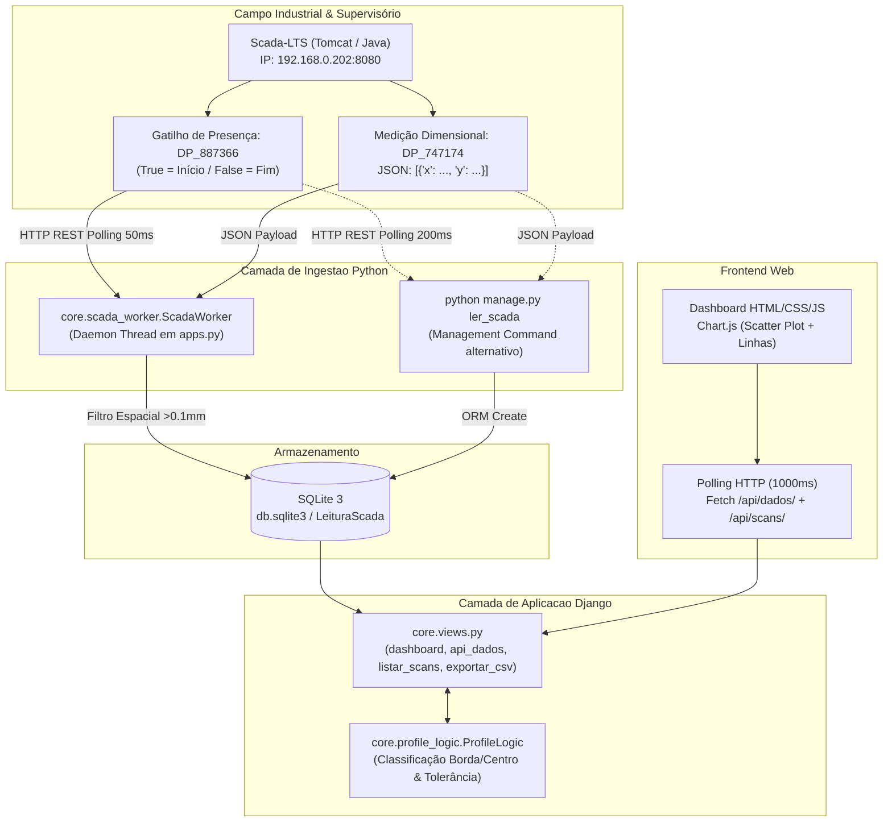

# Relatório Técnico de Estado Atual e Arquitetura do Projeto
## Medidor de Espessura Industrial (`Med_espessura`)

> **Finalidade do Documento:** Fornecer contexto técnico integral, arquitetura de software, mapeamento de regras de negócio, modelo de dados, fluxos de integração e pontos de atenção para consumo por agentes de IA e engenheiros responsáveis por conduzir futuras baterias de melhorias e refatorações no sistema.
>
> **Data de Levantamento:** Outubro de 2026  
> **Versão Django:** 6.1.1 | **Python:** 3.14.6  
> **Status do Repositório:** Funcional em ambiente de desenvolvimento / homologação local.

---

## 1. Visão Geral e Propósito do Sistema

O projeto **Medidor de Espessura** é uma aplicação web industrial desenvolvida em Django cujo propósito é:
1. **Aquisição de Dados em Tempo Real:** Coletar medições dimensionais contínuas de perfis e chapas de borracha/compostos industriais geradas pelo supervisório **Scada-LTS** (instalado em `http://192.168.0.202:8080/Scada-LTS`).
2. **Gerenciamento de Ciclos de Varredura (Scans):** Detectar bordas de subida e descida de sensores de presença/gatilho (`DP_887366`), delimitando cada passagem de chapa como um lote/ciclo de medição individual (`scan_id`).
3. **Classificação e Validação Geométrica:** Comparar cada coordenada `(X, Y)` com especificações nominais de espessura de borda e centro, aplicando tolerâncias e classificando os pontos em status `OK` ou `NOK` e zonas `Borda (Nível)` ou `Centro (Nível)`.
4. **Visualização Gráfica Industrial:** Exibir o perfil transversal da chapa através de um gráfico de dispersão (*scatter chart*) em tempo real via Chart.js, permitindo ajuste dinâmico de tolerâncias pela interface e visualização histórica de medições anteriores.
5. **Auditoria e Exportação:** Permitir download de relatórios em formato CSV delimitado por ponto e vírgula com formatação decimal brasileira.

---

## 2. Topologia e Arquitetura de Alto Nível



---

## 3. Estrutura de Arquivos e Diretórios

```
Med_espessura/
│
├── setup/                                  # Configurações do Projeto Django
│   ├── __init__.py
│   ├── asgi.py                             # Entrada ASGI
│   ├── wsgi.py                             # Entrada WSGI
│   ├── settings.py                         # Configurações de banco, apps, middleware e templates
│   └── urls.py                             # Roteamento global de URLs
│
├── core/                                   # App Django Principal do Sistema
│   ├── __init__.py
│   ├── apps.py                             # Inicialização do App e disparo do ScadaWorker
│   ├── admin.py                            # Registro no Django Admin (atualmente vazio)
│   ├── models.py                           # Modelo ORM LeituraScada
│   ├── profile_logic.py                    # Regras de cálculo geométrico e tolerâncias
│   ├── scada_worker.py                     # Thread background de leitura e ingestão da REST API
│   ├── views.py                            # Views de renderização e APIs JSON/CSV
│   ├── urls.py                             # Rotas internas da aplicação
│   ├── tests.py                            # Testes unitários (atualmente vazio)
│   ├── management/
│   │   └── commands/
│   │       └── ler_scada.py                # Comando CLI para monitoramento via terminal
│   ├── migrations/
│   │   ├── 0001_initial.py                 # Criação inicial da tabela LeituraScada
│   │   └── 0002_alter_leiturascada_...     # Adição de scan_id e renomeação de labels
│   ├── static/
│   │   ├── css/
│   │   │   ├── style.css                   # Estilização global Dark Mode industrial
│   │   │   └── style_inputs.css            # Estilos dos campos numéricos da barra de métricas
│   │   └── js/
│   │       └── dashboard.js                # Lógica de renderização Chart.js e polling da UI
│   └── templates/
│       └── core/
│           ├── base.html                   # Template base com CDN do Chart.js e fontes Inter
│           └── dashboard.html              # Interface do dashboard de medição
│
├── db.sqlite3                              # Banco de dados local SQLite (3084 registros em 59 scans)
├── requirements.txt                        # Dependências Python do ambiente virtual
├── Instrucoes_execucao.txt                 # Instruções rápidas de inicialização e credenciais padrão
├── guia_leitura_scadalts.py                # Script independente/boilerplate com simulação Mock
├── DOCUMENTO_INTEGRACAO_MYSQL_SCADALTS.md  # Referência técnica de migração para MySQL Direto
└── RELATORIO_ESTADO_ATUAL_PROJETO.md       # Este documento de referência e contexto
```

---

## 4. Camada de Dados e Modelo ORM

O modelo principal do sistema está implementado em `core/models.py`:

```python
class LeituraScada(models.Model):
    scan_id = models.CharField(max_length=50, verbose_name="ID do Ciclo", db_index=True, null=True, blank=True)
    xid = models.CharField(max_length=100, verbose_name="Identificador do Ponto")
    eixo_x = models.FloatField(verbose_name="Largura (X)")
    eixo_y = models.FloatField(verbose_name="Espessura (Y)")
    data_leitura = models.DateTimeField(verbose_name="Data da Leitura")
    criado_em = models.DateTimeField(auto_now_add=True, verbose_name="Criado em")

    class Meta:
        verbose_name = "Leitura Scada"
        verbose_name_plural = "Leituras Scada"
        ordering = ['data_leitura']
```

### Detalhes dos Campos:
* **`scan_id`**: Identificador textual do ciclo gerado no início da varredura no formato `SCAN_YYYYMMDD_HHMMSS`. Possui `db_index=True` para agilizar filtragens e agregações.
* **`xid`**: Identificador do Data Point de origem no Scada-LTS (ex: `DP_747174`).
* **`eixo_x`**: Posição linear transversal em milímetros (largura).
* **`eixo_y`**: Espessura medida pelo sensor óptico/laser em milímetros.
* **`data_leitura`**: Carimbo de tempo extraído do timestamp UNIX retornado pelo Scada-LTS (`ts` em milissegundos).
* **`criado_em`**: Carimbo de tempo do momento exato de inserção no banco local.
* **Ordenação Padrão**: Crescente por `data_leitura` para reproduzir o deslocamento físico da leitura cronologicamente.

### Estado Atual da Base de Dados (`db.sqlite3`):
* **Total de registros gravados:** ~3.084 pontos.
* **Total de ciclos únicos (`scan_id`):** 59 ciclos.
* **Exemplos de ciclos presentes:** `SCAN_20260126_134228` (85 pontos), `SCAN_20260126_110412` (96 pontos).

---

## 5. Regras de Negócio e Validação (`core/profile_logic.py`)

A classe estática `ProfileLogic` centraliza o algoritmo de classificação e validação geométrica de cada ponto:

### Constantes Padrão:
* `ESPESSURA_CENTRO = 10.0 mm`
* `ESPESSURA_BORDA = 2.0 mm`
* `TOLERANCIA_POSITIVA = 0.5 mm`

### Algoritmo de Validação (`validar_ponto`):
1. **Recebimento de Parâmetros:** Aceita valores dinâmicos de centro, borda e tolerância (enviados via query string a partir da interface) ou utiliza as constantes padrão.
2. **Identificação de Nível Ativo por Proximidade Vertical:**
   * Calcula `dist_borda = abs(y - alvo_borda)`
   * Calcula `dist_centro = abs(y - alvo_centro)`
   * Se `dist_borda < dist_centro`, o ponto é classificado como zona `"Borda (Nível)"` e o alvo ativo é a espessura de borda.
   * Caso contrário, é classificado como `"Centro (Nível)"` e o alvo ativo é a espessura de centro.
   > *Nota de Projeto:* Esta versão substituiu a regra geométrica posicional baseada em X por uma classificação baseada na proximidade vertical em Y.
3. **Cálculo da Janela de Tolerância:**
   * `lim_min = alvo`
   * `lim_max = alvo + tolerancia`
4. **Verificação de Conformidade:**
   * `is_ok = (y >= lim_min and y <= lim_max)`
5. **Retorno Estruturado:**
   * `{'is_ok': bool, 'alvo': float, 'lim_min': float, 'lim_max': float, 'zona': str}`

---

## 6. Mecanismos de Ingestão e Leitura do Scada-LTS

Atualmente o repositório conta com **duas implementações de ingestão ativas no código**, além de um script guia standalone.

### 6.1 Mecanismo 1: `core/scada_worker.py` (Worker em Thread Daemon)
* **Ativação:** Disparado automaticamente dentro de `core/apps.py` quando o Django inicializa via `runserver`:
  ```python
  if os.environ.get('RUN_MAIN') == 'true':
      from .scada_worker import ScadaWorker
      worker = ScadaWorker()
      worker.start()
  ```
* **Configuração de Conexão:**
  * Base URL: `http://192.168.0.202:8080/Scada-LTS`
  * Credenciais: `username='teste'`, `password='teste1'`
  * Data Point Gatilho: `DP_887366`
  * Data Point Medição: `DP_747174`
* **Ciclo de Execução:**
  1. Mantém `requests.Session()` com cabeçalho `User-Agent: MonitorEspessura/IntegratedWorker`.
  2. Consulta a cada 50ms o endpoint de gatilho (`/api/point_value/getValue/DP_887366`).
  3. Se a resposta for redirecionada para `login.htm` ou status != 200, executa um POST com as credenciais em `/login.htm` e retoma o loop.
  4. **Máquina de Estados de Ciclo:**
     * `trigger == True` e `not is_scanning`: Gera novo `current_scan_id = "SCAN_YYYYMMDD_HHMMSS"` e reseta `last_valid_x = -999.0`.
     * `trigger == False` e `is_scanning`: Encerra ciclo e zera `current_scan_id`.
  5. **Leitura e Parse de Dados:**
     * O valor retornado por `DP_747174` é uma string JSON contendo uma lista de coordenadas, por exemplo: `[{"x": 12.4, "y": 2.35}]`.
     * Converte o timestamp `ts` (em ms) para objeto timezone UTC.
     * **Filtro de Deslocamento Espacial:** Apenas salva no banco se `abs(vx - last_valid_x) > 0.1` mm, evitando saturação de pontos duplicados no SQLite quando a chapa para.

### 6.2 Mecanismo 2: `core/management/commands/ler_scada.py` (Comando CLI)
* **Ativação:** Executado manualmente via linha de comando: `python manage.py ler_scada`.
* **Divergências com o Worker:**
  * **Senha configurada:** Está com `'teste'` (enquanto no worker está `'teste1'`).
  * **Taxa de amostragem:** Utiliza loop com intervalo de 200ms (`max(0, 0.2 - elapsed)`), enquanto o worker usa 50ms.
  * **Filtro espacial:** Não possui o filtro de sensibilidade `abs(vx - last_valid_x) > 0.1`.
  * **Feedback:** Imprime no console via `self.stdout.write` e carriage return `\r`.

### 6.3 Script Independente: `guia_leitura_scadalts.py`
* Script Python executável de forma isolada (sem depender do Django).
* Implementa a classe `ScadaLTSConnector` e um modo fallback `USE_MOCK_FALLBACK = True` (`MockScadaResponse`) para permitir testes quando o supervisório físico estiver inacessível.

---

## 7. Rotas e Endpoints da Aplicação

Definidas em `core/urls.py` e mapeadas na raiz em `setup/urls.py`:

| Rota | View | Método | Descrição |
| :--- | :--- | :--- | :--- |
| `/` | `views.dashboard` | `GET` | Renderiza a página principal do dashboard (`dashboard.html`). |
| `/api/dados/` | `views.api_dados_scada` | `GET` | Retorna coordenadas e validações do perfil para o gráfico. |
| `/api/scans/` | `views.listar_scans` | `GET` | Retorna lista com todos os `scan_id`s existentes no banco ordenados do mais recente para o mais antigo. |
| `/exportar/csv/` | `views.exportar_csv` | `GET` | Gera arquivo CSV formatado com as medições e validações. |
| `/admin/` | `admin.site.urls` | `GET/POST` | Painel de administração padrão do Django. |

### Detalhamento dos Parâmetros das APIs:

#### `GET /api/dados/`
* **Parâmetros Query Opcionais:**
  * `scan_id`: Identificador do ciclo desejado. Se omitido, busca o ciclo mais recente (`Max('scan_id')`).
  * `esp_borda`: Sobrescreve o alvo de espessura da borda (padrão: 2.0).
  * `centro`: Sobrescreve o alvo de espessura do centro (padrão: 10.0).
  * `tol`: Sobrescreve a tolerância positiva (padrão: 0.5).
* **Formato de Resposta (JSON):**
  ```json
  {
    "scan_id": "SCAN_20260126_134228",
    "count": 85,
    "data": [
      {
        "x": 0.0,
        "y": 0.3,
        "target": 2.0,
        "min": 2.0,
        "max": 2.5,
        "is_ok": false,
        "zona": "Borda (Nível)",
        "ts": "16:43:12"
      }
    ]
  }
  ```

#### `GET /exportar/csv/`
* Gera arquivo `relatorio_[scan_id].csv` ou `relatorio_geral_[data].csv`.
* Cabeçalho: `Scan ID;X (mm);Y (mm);Status;Zona`.
* Separação decimal convertida de ponto para vírgula (ex: `12,5`).
* Status: `"OK"` ou `"NOK"`.

---

## 8. Frontend e Visualização

### Componentes de Interface (`dashboard.html`):
1. **Header com Seletor Dinâmico de Scans:** Um elemento `<select>` é injetado via JavaScript contendo a opção default `-- Monitoramento Ao Vivo --` e as opções de histórico populadas via `/api/scans/`.
2. **Cards de Parâmetros e Métricas:**
   * Campo numérico: *Espessura Borda (mm)* (id: `logic-esp-borda`).
   * Campo numérico: *Espessura Centro (mm)* (id: `logic-centro`).
   * Campo numérico: *Tolerância (+) (mm)* (id: `logic-tol`).
   * Indicador textual: *Status do Ciclo* (id: `current-scan-id`).
3. **Card do Gráfico Principal (`profileChart`):** Canvas renderizado com Chart.js.

### Comportamento do JavaScript (`dashboard.js`):
* **Gráfico Scatter + Linhas Contínuas:**
  * Dataset 0 (`scatter`): Pontos reais medidos. Cor dinâmica: verde (`#22c55e`) se `is_ok == true`, vermelho (`#ef4444`) se `is_ok == false`.
  * Dataset 1 (`line`): Limite Máximo (`#fbbf24`, tracejado `[5, 5]`).
  * Dataset 2 (`line`): Linha de Alvo Nominal (`#94a3b8`, contínua).
  * Dataset 3 (`line`): Limite Mínimo (`#fbbf24`, tracejado `[5, 5]`).
* **Modos de Operação:**
  * **Modo Tempo Real:** Quando o select está em `-- Monitoramento Ao Vivo --`, executa polling a cada 1.000 ms via `setInterval`. Atualiza o gráfico e recalcula a lista de scans esporadicamente (`Math.random() < 0.1`).
  * **Modo Histórico:** Disparado ao selecionar um scan anterior no dropdown. O polling é congelado e o gráfico exibe os dados estáticos do ciclo selecionado.
* **Reatividade Instantânea:** Eventos de `change` nos inputs de espessura e tolerância invocam `fetchData()` imediatamente, recalculando os limites e o status de conformidade sem necessidade de recarregar a página.

---

## 9. Instruções de Operação e Execução do Projeto

Conforme documentado em `Instrucoes_execucao.txt`:

1. **Ativar o Ambiente Virtual:**
   ```powershell
   .\venv\Scripts\activate
   ```
2. **Iniciar a Aplicação:**
   ```powershell
   python manage.py runserver
   ```
   > *Nota:* Como `core/apps.py` dispara o `ScadaWorker` quando `RUN_MAIN == 'true'`, o processo de coleta em background inicia automaticamente junto com o servidor web.
3. **Execução Manual do Leitor (Opcional / Standalone):**
   ```powershell
   python manage.py ler_scada
   ```
4. **Acesso ao Sistema:**
   * URL do Dashboard: `http://127.0.0.1:8000/`
   * URL do Admin: `http://127.0.0.1:8000/admin/`
   * Credenciais de Superusuário Criadas:
     * **Usuário:** `admin`
     * **Senha:** `admin`

---

## 10. Documentação Prévia de Referência no Repositório

O repositório contém o arquivo [DOCUMENTO_INTEGRACAO_MYSQL_SCADALTS.md](file:///c:/Users/Unicompo/Documents/03_PYTHON/Med_espessura/DOCUMENTO_INTEGRACAO_MYSQL_SCADALTS.md) (50 kB).  
Esse documento descreve a arquitetura comprovada em outro projeto industrial da empresa (`07 - Painel Manutencao`) para **substituir o consumo via REST API HTTP por conexão direta via MySQL em modo somente-leitura**.

### Principais Lições desse Documento para o Futuro do Projeto:
1. **Eliminação de Sobrecarga:** Troca do overhead de polling HTTP/Tomcat (com relogin frequente e latência de ~200ms) por consultas SQL indexadas diretamente na tabela `pointvalues` do Scada-LTS com latência inferior a 10ms.
2. **Padrão de Conexão Segura:** Uso de alias `"scada"` no `settings.DATABASES`, `routers.py` com bloqueio explícito de migrações e escritas (`PermissionError`), e modelos ORM com `managed=False`.
3. **Tratamento de Desconexão:** Comunicação industrial robusta onde falhas de conexão geram estados explícitos de máquina parada/sem comunicação, sem maquiar dados com nulos ou fallbacks.

---

## 11. Diagnóstico Técnico e Mapeamento de Oportunidades de Melhoria

Para o agente de IA que assumirá as próximas etapas de desenvolvimento, a tabela a seguir resume os pontos de atenção identificados na análise estática do código:

| Área | Situação Atual | Impacto / Risco | Oportunidade de Melhoria |
| :--- | :--- | :--- | :--- |
| **Arquitetura de Ingestão** | `ScadaWorker` roda como `threading.Thread` dentro do processo web do Django (`apps.py`). | Em servidores WSGI/Gunicorn em produção, múltiplos workers gerariam concorrência, conexões duplicadas e bloqueio do SQLite. | Isolar o coletor em um serviço independente (Windows Service, Task Scheduler ou processo CLI separado via daemon). |
| **Consistência de Credenciais** | `ler_scada.py` usa senha `'teste'`; `scada_worker.py` usa `'teste1'`. | Se o comando manual for executado, pode falhar na autenticação caso a senha do Scada seja alterada. | Centralizar credenciais e URLs em variáveis de ambiente (`.env` / `settings.py`). |
| **Duplicidade de Coleta** | Se o operador rodar `python manage.py runserver` e `python manage.py ler_scada` simultaneamente, ambos coletam e salvam os mesmos pontos. | Registros duplicados na tabela `LeituraScada` e contenção de escrita no SQLite. | Implementar trava de processo único (*Cross-process Lock* via arquivo ou mutex) antes de iniciar qualquer rotina de coleta. |
| **Banco de Dados** | SQLite3 local com alta taxa de escrita (50ms). | Risco de exceções de concorrência (`database is locked`) em períodos contínuos de medição intensa. | Ajustar `timeout` do SQLite ou migrar para banco relacional industrial (PostgreSQL / MySQL). |
| **Segurança e Settings** | `DEBUG = True`, `SECRET_KEY` exposta no código, `ALLOWED_HOSTS = []`. | Vulnerabilidade em caso de publicação na rede industrial corporativa. | Adicionar suporte a `django-environ` ou `python-dotenv` e sanitizar credenciais. |
| **Django Admin** | `core/admin.py` não registra `LeituraScada`. | O operador não consegue auditar ou expurgar dados via interface administrativa padrão do Django. | Registrar `LeituraScadaAdmin` com filtros por `scan_id`, data e paginação eficiente. |
| **Testes Automatizados** | `core/tests.py` está vazio. | Risco de regressão nas regras geométricas de `ProfileLogic` ou na geração do CSV durante refatorações. | Criar suíte de testes unitários para `ProfileLogic.validar_ponto`, endpoints da API e parsing de JSON. |
| **Frontend / Tempo Real** | Polling HTTP a cada 1 segundo (`setInterval` com `fetch`). | Overhead de requisições HTTP desnecessárias quando não há varredura ativa. | Implementar WebSockets (Django Channels) ou Server-Sent Events (SSE) para envio reativo apenas quando novos pontos forem gerados. |
| **Tratamento de Timezone** | Conversão de timestamp do Scada assume UTC puro (`tz=timezone.utc`), ignorando fuso local. | Históricos podem apresentar defasagem de fuso horário em relação ao relógio das máquinas na fábrica (`America/Sao_Paulo`). | Padronizar fuso horário em `settings.py` (`TIME_ZONE = 'America/Sao_Paulo'`). |

---

## 12. Conclusão e Próximos Passos Recomendados

O sistema **Medidor de Espessura** possui uma base funcional bem estruturada, código conciso e lógica geométrica modular desacoplada da camada de apresentação. O fluxo de dados ponta a ponta (aquisição ➔ parsing ➔ banco ➔ lógica ➔ API ➔ gráfico) está validado e operacional com histórico real gravado.

A próxima bateria de melhorias poderá priorizar:
1. **Configuração e Isolamento:** Parametrização via `.env` e correção da duplicidade de execução do worker.
2. **Migração para Leitura Direta MySQL:** Adoção do modelo descrito em `DOCUMENTO_INTEGRACAO_MYSQL_SCADALTS.md` para ganho substancial de desempenho e confiabilidade.
3. **Cobertura de Testes:** Criação de testes unitários para a camada de regras de negócio.
4. **Refinamento do Frontend e Admin:** Registro dos modelos no Django Admin e aprimoramento da experiência visual e métricas estatísticas da chapa (ex: média, desvio padrão e histograma de espessura).
